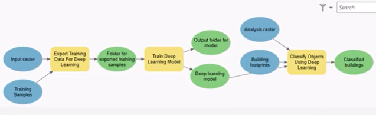

# Plant Detection with ArcGIS + Python
GIF Demo:

## Background

There are four popular computer vision tasks that are used commonly and relevant to our project (inspired by huggingface.co)
- Image classification
- Image segmentation
- Zero-shot classification
- Object detection
Each one of these techniques has their advantages and disadvantages.

There are also a few very similar papers that uses semantic segmentation, instance segmentation, and object detection to identify plants.
Instance Segmentation
- "Mask R-CNN Refitting Strategy for Plant Counting and Sizing in UAV Imagery
Semantic Segmentation"
- "Corn Plant Counting Using Deep Learning and UAV Images"
Object Detection
- "Plant detection and counting from high-resolution RGB images acquired from UAVs: comparison between deep-learning and handcrafted methods with application to maize, sugar beet, and sunflower"
- "A Convolutional Neural Network-Based Method for Corn Stand Counting in the Field"

## Tooling/Requirements

Requirements for running machine learning models in ArcGIS Pro:
- ArcGIS Pro 
    - Free license for Purdue students: https://www.rcac.purdue.edu/downloads/geospatial/arcgis/arcgis_pro
    - Free license for ASU students: https://libguides.asu.edu/esrisoftware/arcgispro
- CUDA-enabled GPU
    - A list of CUDA compatible GPU’s is listed here: https://en.wikipedia.org/wiki/CUDA#GPUs_supported
- CUDA
- Deep Learning Framework for ArcGIS Pro
    - This can be downloaded following this guide: https://www.esri.com/arcgis-blog/products/arcgis-pro/imagery/deep-learning-with-arcgis-pro-tips-tricks/
-   ArcGIS Python API
     - A tutorial on how to use the Python API: https://www.youtube.com/watch?v=xxHKCTnZ9c8

Some other labeling software we discovered along the way are (these do not appear to be compatible with the ArcGIS Pro workflow):
- LabelStudio
- LabelMe

## Exceptions to the Normal Process
According to this guide (https://www.youtube.com/watch?v=JVizDjlN73c), the typical workflow for training a deep learning model inside ArcGIS Pro involves using the “Train Deep Learning Model” module under the Geoprocessing tab, which supposedly creates a .dlpk file that then can be fed into “Detect Objects using Deep Learning”. 

However, instead of using the “Train Deep Learning Model” to create .dlpk files, we used the arcgis.gis library in JupyterNotebooks to and the model.save(‘name_of_file’) function to create a .dlpk file.

## Errors
Error: When applying a model in ArcGIS Pro, the model does not identify any corn plants.
-	Solution 1: Decrease the raster size for the image chips.
-	Solution 2: Clip (i.e. crop) the orthomosaic and fully label all plants before using “Export Training Data” tool.
-	Solution 3: Avoid randomly labeling plants in different areas, stick to one dense area.
 
